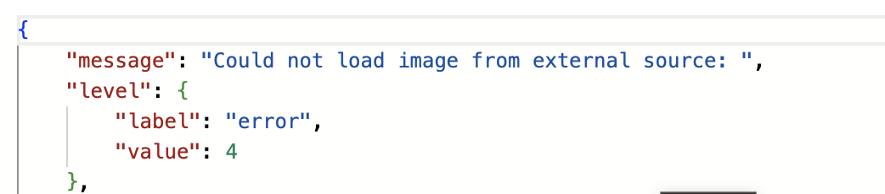
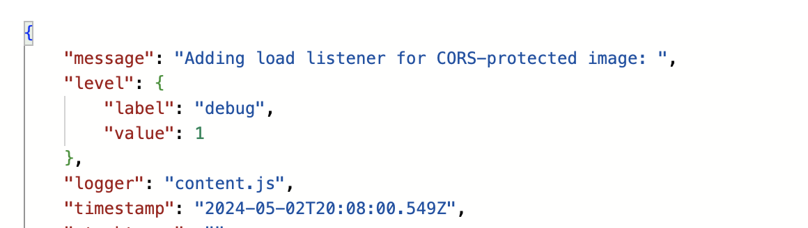

# Log Results
- Log Collection Date: 05/03/2024
- Extension Version: 0.2.0 - 0.3.0
- Log Collector: Daniel Luper (developer)

## Summary
Most of the logs contained expected behavior. However, there were a few logs that were unexpected.

## Bugs Discovered
### Not printing the image source
Some logs were missing the image source. Without the source, it is difficult to debug errors. This issue suggests that either the `src` attribute is sometimes empty, the source value is not being passed correctly, or the log message is not being printed correctly.

Examples:

### Describing GIFs
Our image captioning models are not trained to describe GIFs, and yet the logs show that the extension is trying to describe them. If the source ends with `.gif`, the extension should not attempt to describe the image.

### Describing icons
Our image captioning models are not trained to describe icons and other small images, and yet the logs show that the extension is trying to describe them. Additionally, accessibility guidelines like [WCAG 2.1](https://www.w3.org/WAI/WCAG21/quickref/) do not require alt text for decorative images. Furthermore, some webpages (like Google Search results), have lots of small icons, and our extension gets a big performance hit from trying to describe all of them. To combat these 3 issues (inaccuracy, deviation from guidelines, and reduced performance), we propose the following policy: if the image is smaller than a certain size, the extension should not attempt to describe the image.

### Duplicate logs
"Initializing Chrome plugin" and "Chrome plugin initialized" gets logged multiple times back-to-back from content.js. This suggests that the initialization function gets executed multiple times instead of getting executed once for each web page.

## Insights
- A lot of the image sources are `data:image` URLs. This suggests that the images are being loaded from the local storage or the browser cache. While this is expected behavior, it makes it impossible for developers to view the images directly from the source URL for evaluating description quality.

## Positive Results
- The logs are well-organized and easy to filter and read.
- The logs contain information that is useful for debugging.
- One of the logs showed that the lightweight model performed surprisingly well on the following image:

The description was: "Image that contains web site, website, internet site, site and could possibly have affenpinscher, monkey pinscher, monkey dog."
